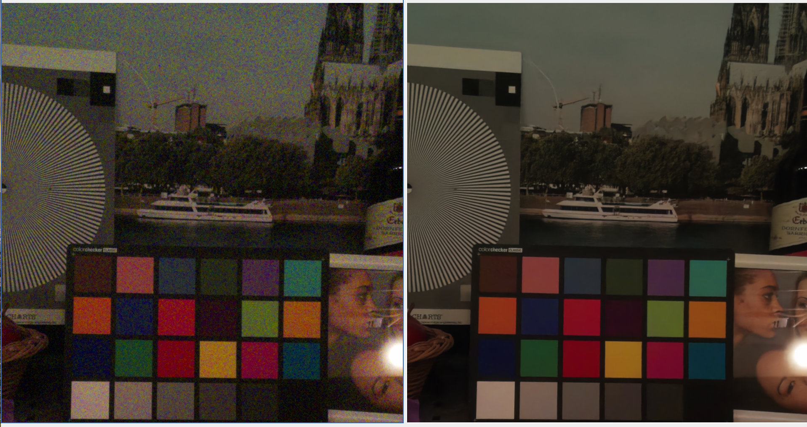

# AI Image Denoising Tool

This project provides tools for capturing noisy images from a Raspberry Pi camera and denoising them using an AI model. It consists of two main scripts:

1. `capture_noisy.py`: Captures images from the Raspberry Pi camera with no noise reduction or sharpening
2. `ai_denoise.py`: Denoises images using a TFLite model

## Example



The original image, taken with a v2 camera (imx219) at gain 12.0x, is on the left; the denoised version on the right.

## Installation

1. Clone this repository
2. Install the required packages (picamera2, numpy and Pillow should already be available on your system, so only the TensorFlow Lite runtime is required):
```bash
pip install ai_edge_litert
```

## Usage

### Capturing Noisy Images

`capture_noisy.py` shows how to capture images from the Raspberry Pi camera without noise reduction or sharpening. You can incorporate it into your own code, or use it directly:

```bash
python capture_noisy.py -o output.png
```

Options:
- `-o, --output`: Output file path (required)
- `-c, --camera`: Camera number to use (default: 0)
- `-g, --gain`: Analogue gain to apply (default: use auto gain)

Example with all options:
```bash
python capture_noisy.py -o noisy_image.png -c 0 -g 2.0
```

### Capturing Noisy Images with `rpicam-still`

Alternatively, you can use `rpicam-still` to capture noisy images instead. Be sure to supply the following additional parameters:
- `--encoding png`: write the output as a PNG file
- `--denoise off`: disable all noise reduction
- `--sharpness 0`: disable all sharpening

Example:
```bash
rpicam-still --encoding png --denoise off --sharpness 0 -o noisy.png
```

You may wish to add a specific gain value, using the `--gain` parameter, depending on your application.

### Denoising Images

Use `ai_denoise.py` to denoise images using the AI model:

```bash
python ai_denoise.py -i input.png -o output.png
```

Options:
- `-i, --input`: Input image file to denoise (required)
- `-o, --output`: Output file path for the denoised image (required)
- `-m, --model`: Path to the TFLite model file (default: nafnet.tflite)

Example with all options:
```bash
python ai_denoise.py -i noisy_image.png -o denoised.png -m custom_model.tflite
```

Alternatively, you can import the `denoise_image` function and use it in your own code.

## Notes

- We recommend using PNG format for both input and output images
- Images must be at least 256x256 pixels in size
- Image denoising currently works only on full 3-channel RGB images
- The model runs at about 12 seconds per MP on a Pi 5 (though can be run on other computers too)
- The default model file (nafnet.tflite) must be present in the same directory
- The model is trained only on Raspberry Pi cameras at full resolution - in all other cases, your mileage may vary
- Images are slightly soft after denoising and will benefit from some sympathetic sharpening
- We may retrain and update the denoise models in future in order to improve performance
- The supplied model is an implementation of [NAFNet](https://arxiv.org/pdf/2204.04676v4).